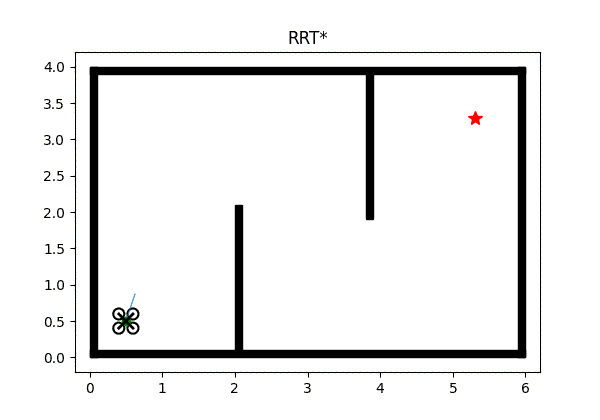
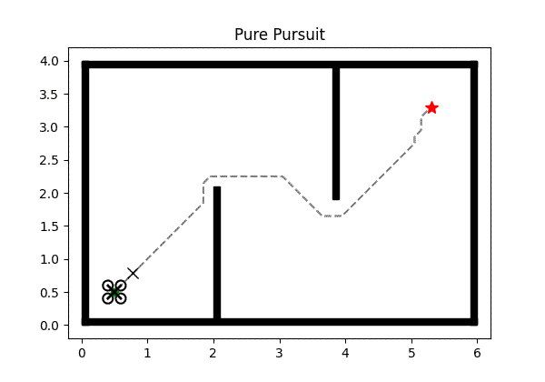
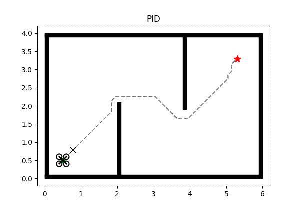
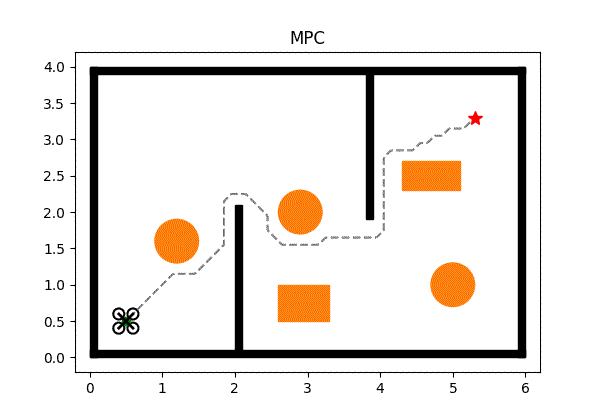

# Motion Planning for UAV

Planification de trajectoire et suivi pour un drone Crazyflie (2D, ROS2).

## Planners
| A* | RRT* |
|:--:|:--:|
|  |  |

## Controllers
| Pure Pursuit | PID | LQR | MPC |
|:--:|:--:|:--:|:--:|
|  |  |  |  |

## Paper
- [A Formal Basis for the Heuristic Determination of Minimum Cost Paths (A*)](https://doi.org/10.1109/TSSC.1968.300136)
- [Sampling-based Algorithms for Optimal Motion Planning (RRT*)](https://arxiv.org/abs/1105.1186)
- [Implementation of the Pure Pursuit Path Tracking Algorithm (Pure Pursuit)](https://www.ri.cmu.edu/publications/implementation-of-the-pure-pursuit-path-tracking-algorithm/)
- [The Future of PID Control (PID)](https://doi.org/10.1016/S0967-0661(01)00062-4)
- [Introduction to Optimal Control (LQR)](https://cel.archives-ouvertes.fr/hal-02987731v1)
- [Constrained Model Predictive Control: Stability and Optimality (MPC)](https://doi.org/10.1016/S0005-1098(99)00214-9)
