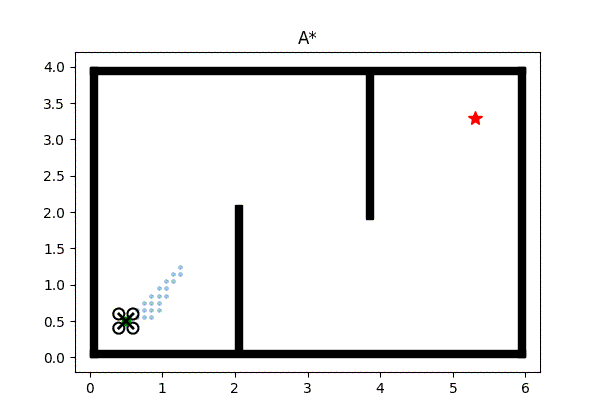

# Motion Planning for UAV

Planification de trajectoire et suivi pour un drone Crazyflie (2D, ROS2).

## Planners
| A* |
|:--:|
|  |

## Controllers
À venir : Pure Pursuit, PID, LQR, MPC.

## Paper
- [A Formal Basis for the Heuristic Determination of Minimum Cost Paths (A*)](https://doi.org/10.1109/TSSC.1968.300136)
- [Sampling-based Algorithms for Optimal Motion Planning (RRT*)](https://arxiv.org/abs/1105.1186)
